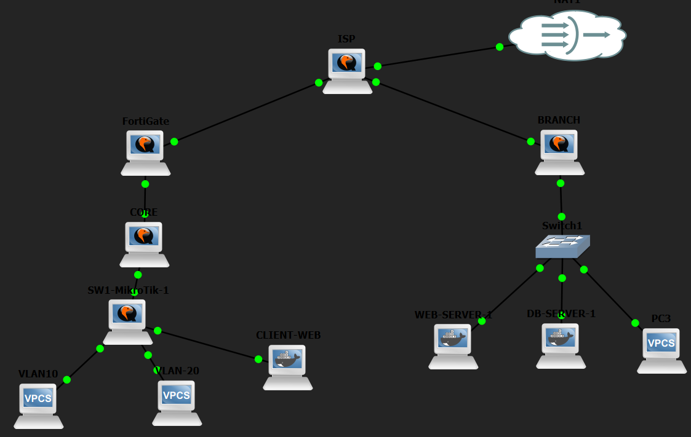
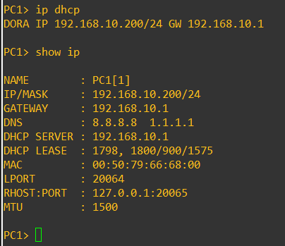
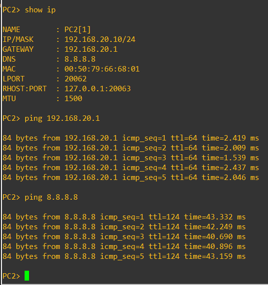
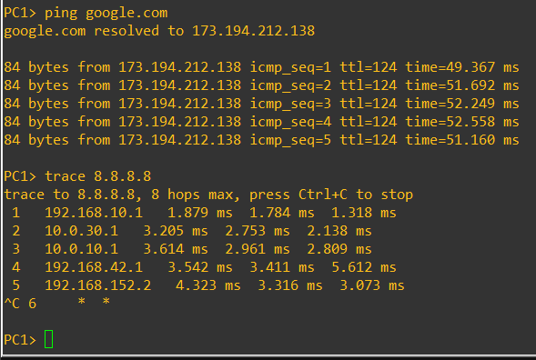
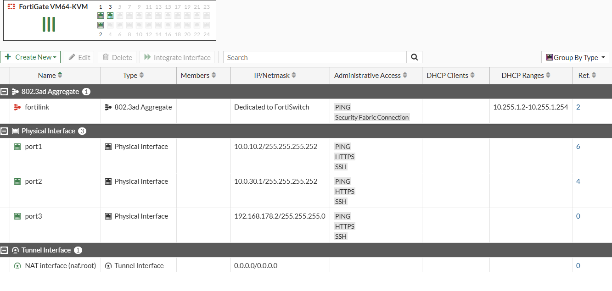
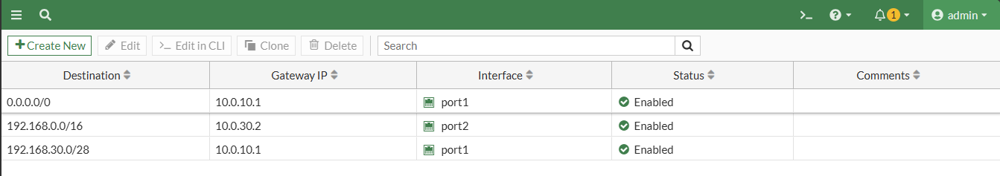

# Laboratorio de Seguridad con FortiGate en GNS3

## Video de demostración

[Ver video en YouTube](https://www.youtube.com/watch?v=niOl9BpEW3w&t=0s)

## Propósito

El objetivo de este laboratorio es implementar y demostrar una infraestructura de red segmentada y protegida mediante FortiGate, incluyendo VLANs, salida a Internet, NAT, VPN IPsec, filtrado web, control de acceso al servidor Web y registro de tráfico.

La topología fue implementada en GNS3 utilizando FortiGate, routers MikroTik, equipos de usuarios y servidores Linux.

## Topología

La infraestructura está compuesta por:

- FortiGate FGT-HQ.
- Router ISP.
- Router CORE.
- Switch SW1.
- Router BRANCH.
- PC de usuarios en VLAN 10.
- PC administrativo en VLAN 20.
- Web Server.
- DB Server.
- Cliente Web para las pruebas HTTP.

## Direccionamiento

### Enlaces principales

- FortiGate WAN: `10.0.10.2/30`
- ISP hacia FortiGate: `10.0.10.1/30`
- FortiGate hacia CORE: `10.0.30.1/30`
- CORE hacia FortiGate: `10.0.30.2/30`
- ISP hacia BRANCH: `10.0.20.1/30`
- BRANCH WAN: `10.0.20.2/30`

### Redes internas

- VLAN 10 Usuarios: `192.168.10.0/24`
- Gateway VLAN 10: `192.168.10.1`
- VLAN 20 Administrativos: `192.168.20.0/24`
- Gateway VLAN 20: `192.168.20.1`
- Red de servidores: `192.168.30.0/28`
- Web Server: `192.168.30.2`
- DB Server: `192.168.30.3`

## VLAN 10 y DHCP

La VLAN 10 corresponde a la red de usuarios. El equipo PC1 recibe su configuración mediante DHCP desde el router CORE.

## VLAN 20

La VLAN 20 corresponde a los usuarios administrativos. Se verificó conectividad con su gateway y salida hacia Internet.

## Salida a Internet y NAT

El FortiGate utiliza una ruta por defecto hacia el ISP y una política con NAT para permitir la salida de las redes internas hacia Internet.

Se verificó conectividad mediante ping y traceroute.

## Interfaces del FortiGate

Las principales interfaces utilizadas son:

- `port1`: WAN hacia ISP.
- `port2`: enlace de tránsito hacia CORE.
- `port3`: administración mediante GUI.

## Rutas estáticas

El FortiGate contiene las rutas necesarias para Internet, las redes internas y la red de servidores.

## VPN IPsec

Se configuró una VPN IPsec entre FGT-HQ y BRANCH.

La comunicación entre la VLAN 10 y la red de servidores se realiza mediante el túnel VPN.

Se verificó el recorrido hacia el Web Server mediante traceroute.

Al deshabilitar la VPN, la comunicación con el servidor dejó de funcionar.

Al habilitar nuevamente el túnel, la conectividad fue restablecida.

## Servidor Web

El Web Server utiliza la dirección:

`192.168.30.2/28`

El servicio HTTP está disponible por el puerto TCP 80.

## Acceso HTTP desde VLAN 10

La política del FortiGate permite a los usuarios de VLAN 10 acceder al Web Server únicamente utilizando HTTP por el puerto 80.

Se comprobó que el puerto TCP 80 está permitido.

Otros servicios hacia el Web Server, como TCP 443, son bloqueados.

## Web Filter

Se configuró el perfil `WF-INVENTARIO` para restringir el acceso desde VLAN 10 a la sección:

`http://192.168.30.2/inventario/`

La página principal del servidor continúa disponible, mientras que `/inventario/` es bloqueado.

## Registros de seguridad

El FortiGate registra los intentos de acceso a servicios no permitidos mediante Forward Traffic.

Los eventos relacionados con el bloqueo de `/inventario/` también quedan registrados por el Web Filter.

## Servidor de Base de Datos

El DB Server utiliza:

`192.168.30.3/28`

MariaDB se encuentra escuchando mediante TCP en el puerto `3306`.

## Archivos de configuración

El repositorio contiene las configuraciones utilizadas en los equipos principales:

- `fortigate.txt`
- `isp-mikrotik.txt`
- `branch-mikrotik.txt`
- `core-mikrotik.txt`
- `sw1-mikrotik.txt`

## Resultado

Se logró implementar segmentación mediante VLANs, DHCP para usuarios, conectividad hacia Internet mediante NAT, comunicación segura mediante VPN IPsec, acceso controlado al servidor Web, bloqueo de servicios no autorizados, filtrado de la sección `/inventario` y registro de los eventos generados por las políticas de seguridad.
